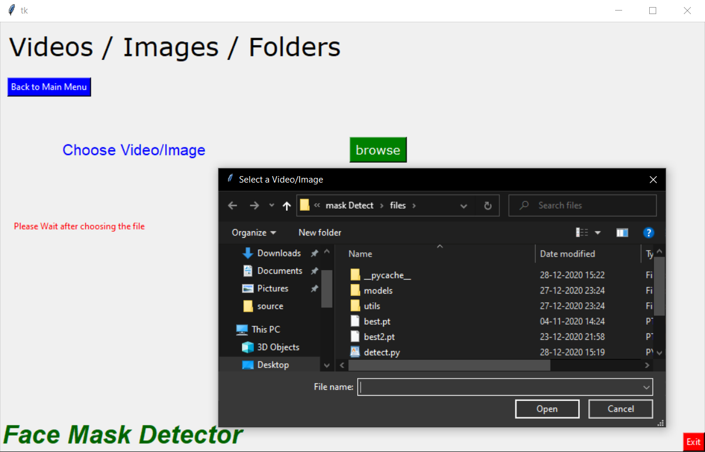
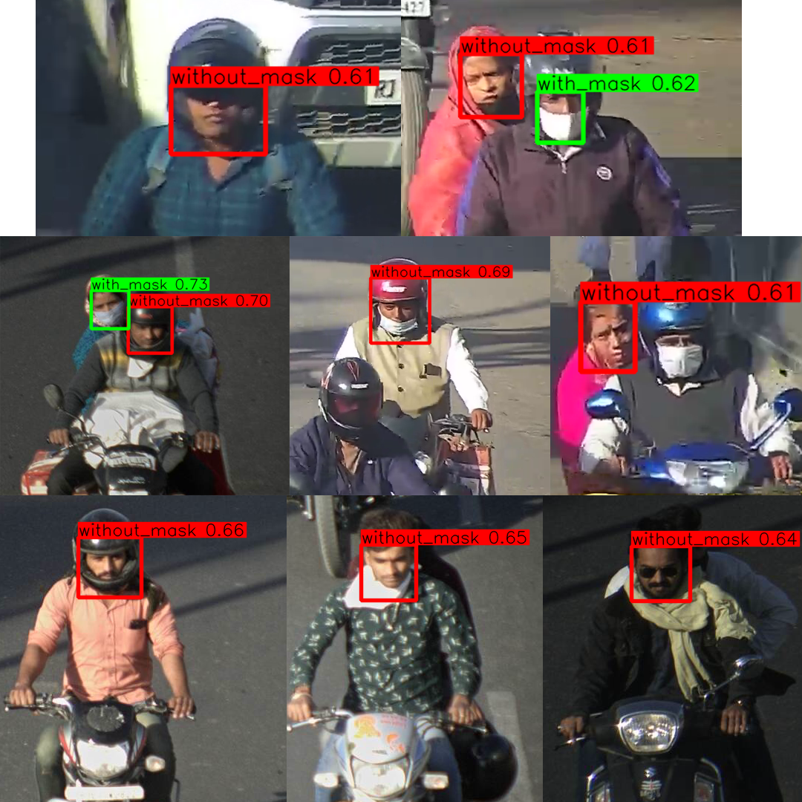

# Face-Mask-Detector

[](https://github.com/rohandubey/Face-Mask-Detector/blob/master/LICENSE)


[](https://pypi.python.org/pypi/trains-jupyter-plugin/) 
<br></br>
In the amidst of COVID-19, as there is no proper channel to effectively monitor people wearing mask and not. So to tackle this problem, I made an AI solution based on YOLOv5 model to detect those who are **not wearing mask**. This software is tested by Rajasthan Police (Govt. of India), and is designed to be installed alongside their CCTVs for efficient working. This software can **multi-stream** many sources together and collects data contionuously from those streams.
Based on **YOLOv5** model and **RetinaNet Architecture**, having <br>
|  |  | 
|---------- |------ |
| Accuracy   | 98%     | 
| Mean Average Precision (val)   | 54.98     | 
| FPS (max)    | 300+     |

_Model runs on on a variety of sources like images, videos, directory, glob, http/rtsp/rtmp streams._

## Requirements

Python 3.8 or later with all [requirements.txt](https://github.com/rohandubey/Face-Mask-Detector/blob/master/requirements.txt) dependencies installed, including `torch>=1.7`. To install run:
```bash
$ pip install -r requirements.txt
```
## Inference
**_Linux :_**
execute : ```./run.sh```<br>
**_Windows :_**
execute : c```run.bat```<br>
For more smoother inference visit [CUDA](https://developer.nvidia.com/cuda)/[CUDNN](https://developer.nvidia.com/cudnn), [Python](https://www.python.org/) and [PyTorch](https://pytorch.org/) to verify for correct versions
## Working
- When the program is initialized by running `./run.sh` or `run.bat`, we see the following GUI having 3 inputs namely, **Camera, Web Links, Videos/Images/Folders.**
* * 
* **1. Camera**: Submit the Camera ID for any local cameras connected to your device. ( 0 for default camera)<br>
* * 
* **2. Web Links**: Choose the link type : http/rtmp/rtsp and enter the IP address, if IP is password protected, then enter Username and password(if required)<br>
* * 
* **3. Images/Videos/Folders**: for any Videos/Images/Folder that contains Videos/Images, choose the path in Browse button and after choosing we can see progress of detection and time left.<br>
* * 
* * Progress : 
* * 
## Detection Results
For Videos/Images the output videos/images is stored in `imference/output` Post-Detection.<br>
For Live streams from Webcam or WebStream (ex. `http://ip`), all images without mask are stored in `inference/data/<DATE>/<TIME>.png` format, so all the images detectedin a day are stored in one folder time-wise like :
```
$ tree --dirsfirst
├── inference\data\

│	├── 21_Dec_20                    (folder name = date)
   	├── 21_Dec_20 15_28_54.png       (time is 15:28:54)
   	└── 21_Dec_20 12_20_05.png
...	│   ...
│	├── 22_Dec_20
   	├── 22_Dec_20 05_08_04.png    
   	└── 22_Dec_20 02_00_55.png
```
***Demo Pic form Live Stream*** <br>
 <br>
[***Demo Video from YouTube*** <br>](https://drive.google.com/file/d/1DfX1nSEcgMyTUz4v5BD5aRJU7cykBWzn/view?usp=sharing) Click to open!

## Built With
* YOLOv5 - Object Detection Algorithm
* OpenCV - Video/Image Streaming
* Tkinter - GUI toolkit for Python.
* PyTorch - Model training/detection Framework.
* Batch/Bash - Easy execution Programming languages for Windows/Linux respectively.
* onnx - An ecosystem for interchanging different ML Model Frameworks.
## Training Results
- Model is trained os NVIDA 940MX 2GB(used TensorFlow-GPU with CUDA).
- I created and labelled my own dataset using [Label data Helper](https://github.com/rohandubey/Label-Data-Helper).
- Added multi-threading to make detection smoother and faster.
- Added GUI for easy support and analysis.
- Converted raw pyton files to **batch** and **bash** script for direct usage.

## Authors
Made with ❤️ by Rohan Dubey
## References
- [OpenCV](https://github.com/opencv/opencv)
- [YOLOv5](https://github.com/ultralytics/yolov5)
- [PyTorch](https://github.com/pytorch/pytorch)
